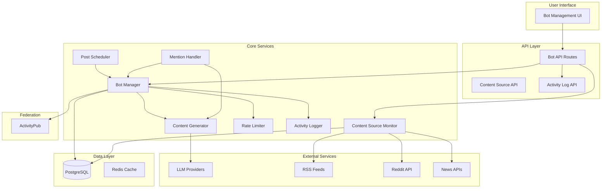

# Design Document: Bot System

## Overview

This document describes the technical design for implementing an autonomous bot system in Synapsis. The system enables users to create bots that monitor external content sources (RSS, Reddit, news APIs), generate posts using LLM APIs, and respond to mentions. Bots operate as special user entities with clear identification and configurable personalities.

The design integrates with existing Synapsis infrastructure:
- Drizzle ORM for database operations
- Next.js API routes for endpoints
- ActivityPub federation for cross-instance communication
- Existing authentication and user systems

## Architecture



### Component Responsibilities

1. **Bot Manager**: Core orchestrator for bot lifecycle, configuration, and operations
2. **Content Source Monitor**: Fetches and parses external content from RSS, Reddit, and news APIs
3. **Post Scheduler**: Manages scheduled and autonomous posting based on configuration
4. **Mention Handler**: Detects mentions and triggers response generation
5. **Content Generator**: Interfaces with LLM providers to generate posts and replies
6. **Rate Limiter**: Enforces posting limits and prevents abuse
7. **Activity Logger**: Records all bot actions for auditing and debugging

## Components and Interfaces

### Bot Manager Service

```typescript
interface BotManager {
  // Bot CRUD
  createBot(userId: string, config: BotCreateInput): Promise<Bot>;
  updateBot(botId: string, config: BotUpdateInput): Promise<Bot>;
  deleteBot(botId: string): Promise<void>;
  getBotsByUser(userId: string): Promise<Bot[]>;
  getBotById(botId: string): Promise<Bot | null>;
  
  // Bot Operations
  triggerPost(botId: string, sourceContentId?: string): Promise<Post>;
  processScheduledPosts(): Promise<void>;
  suspendBot(botId: string, reason: string): Promise<void>;
  reinstateBot(botId: string): Promise<void>;
}

interface BotCreateInput {
  name: string;
  handle: string;
  bio?: string;
  avatarUrl?: string;
  personality: PersonalityConfig;
  llmConfig: LLMConfig;
  contentSources?: ContentSourceConfig[];
  schedule?: ScheduleConfig;
  autonomousMode?: boolean;
}

interface PersonalityConfig {
  systemPrompt: string;
  temperature: number;
  maxTokens: number;
  responseStyle?: string;
}

interface LLMConfig {
  provider: 'openrouter' | 'openai' | 'anthropic';
  apiKey: string; // Encrypted before storage
  model: string;
}
```

### Content Source Monitor

```typescript
interface ContentSourceMonitor {
  addSource(botId: string, config: ContentSourceConfig): Promise<ContentSource>;
  removeSource(sourceId: string): Promise<void>;
  fetchContent(sourceId: string): Promise<ContentItem[]>;
  processAllSources(): Promise<void>;
}

interface ContentSourceConfig {
  type: 'rss' | 'reddit' | 'news_api';
  url: string;
  subreddit?: string; // For Reddit
  apiKey?: string; // For news APIs
  fetchInterval: number; // Minutes
  keywords?: string[]; // Optional filtering
}

interface ContentItem {
  id: string;
  sourceId: string;
  title: string;
  content: string;
  url: string;
  publishedAt: Date;
  processed: boolean;
}
```

### Content Generator

```typescript
interface ContentGenerator {
  generatePost(
    bot: Bot,
    sourceContent?: ContentItem,
    context?: string
  ): Promise<GeneratedContent>;
  
  generateReply(
    bot: Bot,
    mentionPost: Post,
    conversationContext: Post[]
  ): Promise<GeneratedContent>;
  
  evaluateContentInterest(
    bot: Bot,
    content: ContentItem
  ): Promise<{ interesting: boolean; reason: string }>;
}

interface GeneratedContent {
  text: string;
  tokensUsed: number;
  model: string;
}
```

### Mention Handler

```typescript
interface MentionHandler {
  detectMentions(botId: string): Promise<Mention[]>;
  processMention(mentionId: string): Promise<void>;
  getUnprocessedMentions(botId: string): Promise<Mention[]>;
}

interface Mention {
  id: string;
  botId: string;
  postId: string;
  authorId: string;
  content: string;
  createdAt: Date;
  processedAt?: Date;
  responsePostId?: string;
}
```

### Rate Limiter

```typescript
interface RateLimiter {
  canPost(botId: string): Promise<{ allowed: boolean; reason?: string }>;
  recordPost(botId: string): Promise<void>;
  getPostCount(botId: string, windowHours: number): Promise<number>;
  getRemainingQuota(botId: string): Promise<{ daily: number; hourly: number }>;
}

// Rate limit constants
const RATE_LIMITS = {
  MAX_POSTS_PER_DAY: 50,
  MIN_POST_INTERVAL_MINUTES: 5,
  MAX_REPLIES_PER_HOUR: 20,
};
```

### Activity Logger

```typescript
interface ActivityLogger {
  log(entry: ActivityLogEntry): Promise<void>;
  getLogsForBot(botId: string, options: LogQueryOptions): Promise<ActivityLog[]>;
  getErrorLogs(botId: string): Promise<ActivityLog[]>;
}

interface ActivityLogEntry {
  botId: string;
  action: 'post_created' | 'mention_response' | 'content_fetched' | 
          'llm_call' | 'error' | 'config_changed' | 'rate_limited';
  details: Record<string, unknown>;
  success: boolean;
  errorMessage?: string;
}

interface LogQueryOptions {
  actionTypes?: string[];
  startDate?: Date;
  endDate?: Date;
  limit?: number;
  offset?: number;
}
```

## Data Models

### Database Schema Additions

```typescript
// New tables for bot system

export const bots = pgTable('bots', {
  id: uuid('id').primaryKey().defaultRandom(),
  userId: uuid('user_id').notNull().references(() => users.id, { onDelete: 'cascade' }),
  name: text('name').notNull(),
  handle: text('handle').notNull().unique(),
  bio: text('bio'),
  avatarUrl: text('avatar_url'),
  
  // Personality configuration (JSON)
  personalityConfig: text('personality_config').notNull(), // JSON
  
  // LLM configuration
  llmProvider: text('llm_provider').notNull(), // openrouter, openai, anthropic
  llmModel: text('llm_model').notNull(),
  llmApiKeyEncrypted: text('llm_api_key_encrypted').notNull(),
  
  // Scheduling
  scheduleConfig: text('schedule_config'), // JSON
  autonomousMode: boolean('autonomous_mode').default(false).notNull(),
  
  // Status
  isActive: boolean('is_active').default(true).notNull(),
  isSuspended: boolean('is_suspended').default(false).notNull(),
  suspensionReason: text('suspension_reason'),
  suspendedAt: timestamp('suspended_at'),
  
  // ActivityPub keys
  publicKey: text('public_key').notNull(),
  privateKeyEncrypted: text('private_key_encrypted').notNull(),
  
  // Timestamps
  lastPostAt: timestamp('last_post_at'),
  createdAt: timestamp('created_at').defaultNow().notNull(),
  updatedAt: timestamp('updated_at').defaultNow().notNull(),
}, (table) => [
  index('bots_user_id_idx').on(table.userId),
  index('bots_handle_idx').on(table.handle),
  index('bots_active_idx').on(table.isActive),
]);

export const botContentSources = pgTable('bot_content_sources', {
  id: uuid('id').primaryKey().defaultRandom(),
  botId: uuid('bot_id').notNull().references(() => bots.id, { onDelete: 'cascade' }),
  
  type: text('type').notNull(), // rss, reddit, news_api
  url: text('url').notNull(),
  subreddit: text('subreddit'), // For Reddit sources
  apiKeyEncrypted: text('api_key_encrypted'), // For news APIs
  
  fetchIntervalMinutes: integer('fetch_interval_minutes').default(30).notNull(),
  keywords: text('keywords'), // JSON array for filtering
  
  isActive: boolean('is_active').default(true).notNull(),
  lastFetchAt: timestamp('last_fetch_at'),
  lastError: text('last_error'),
  consecutiveErrors: integer('consecutive_errors').default(0).notNull(),
  
  createdAt: timestamp('created_at').defaultNow().notNull(),
  updatedAt: timestamp('updated_at').defaultNow().notNull(),
}, (table) => [
  index('bot_content_sources_bot_idx').on(table.botId),
  index('bot_content_sources_type_idx').on(table.type),
]);

export const botContentItems = pgTable('bot_content_items', {
  id: uuid('id').primaryKey().defaultRandom(),
  sourceId: uuid('source_id').notNull().references(() => botContentSources.id, { onDelete: 'cascade' }),
  
  externalId: text('external_id').notNull(), // Unique ID from source
  title: text('title').notNull(),
  content: text('content'),
  url: text('url').notNull(),
  
  publishedAt: timestamp('published_at').notNull(),
  fetchedAt: timestamp('fetched_at').defaultNow().notNull(),
  
  isProcessed: boolean('is_processed').default(false).notNull(),
  processedAt: timestamp('processed_at'),
  postId: uuid('post_id').references(() => posts.id), // If a post was created
  
  interestScore: integer('interest_score'), // LLM evaluation score
  interestReason: text('interest_reason'),
}, (table) => [
  index('bot_content_items_source_idx').on(table.sourceId),
  index('bot_content_items_processed_idx').on(table.isProcessed),
  index('bot_content_items_external_idx').on(table.externalId),
]);

export const botMentions = pgTable('bot_mentions', {
  id: uuid('id').primaryKey().defaultRandom(),
  botId: uuid('bot_id').notNull().references(() => bots.id, { onDelete: 'cascade' }),
  postId: uuid('post_id').notNull().references(() => posts.id, { onDelete: 'cascade' }),
  
  authorId: uuid('author_id').notNull().references(() => users.id),
  content: text('content').notNull(),
  
  isProcessed: boolean('is_processed').default(false).notNull(),
  processedAt: timestamp('processed_at'),
  responsePostId: uuid('response_post_id').references(() => posts.id),
  
  // For federated mentions
  isRemote: boolean('is_remote').default(false).notNull(),
  remoteActorUrl: text('remote_actor_url'),
  
  createdAt: timestamp('created_at').defaultNow().notNull(),
}, (table) => [
  index('bot_mentions_bot_idx').on(table.botId),
  index('bot_mentions_processed_idx').on(table.isProcessed),
  index('bot_mentions_created_idx').on(table.createdAt),
]);

export const botActivityLogs = pgTable('bot_activity_logs', {
  id: uuid('id').primaryKey().defaultRandom(),
  botId: uuid('bot_id').notNull().references(() => bots.id, { onDelete: 'cascade' }),
  
  action: text('action').notNull(), // post_created, mention_response, etc.
  details: text('details').notNull(), // JSON
  
  success: boolean('success').notNull(),
  errorMessage: text('error_message'),
  
  createdAt: timestamp('created_at').defaultNow().notNull(),
}, (table) => [
  index('bot_activity_logs_bot_idx').on(table.botId),
  index('bot_activity_logs_action_idx').on(table.action),
  index('bot_activity_logs_created_idx').on(table.createdAt),
]);

export const botRateLimits = pgTable('bot_rate_limits', {
  id: uuid('id').primaryKey().defaultRandom(),
  botId: uuid('bot_id').notNull().references(() => bots.id, { onDelete: 'cascade' }),
  
  windowStart: timestamp('window_start').notNull(),
  windowType: text('window_type').notNull(), // daily, hourly
  postCount: integer('post_count').default(0).notNull(),
  replyCount: integer('reply_count').default(0).notNull(),
  
  createdAt: timestamp('created_at').defaultNow().notNull(),
}, (table) => [
  index('bot_rate_limits_bot_window_idx').on(table.botId, table.windowStart),
]);
```

### TypeScript Types

```typescript
// Bot types
export interface Bot {
  id: string;
  userId: string;
  name: string;
  handle: string;
  bio?: string;
  avatarUrl?: string;
  personalityConfig: PersonalityConfig;
  llmProvider: 'openrouter' | 'openai' | 'anthropic';
  llmModel: string;
  scheduleConfig?: ScheduleConfig;
  autonomousMode: boolean;
  isActive: boolean;
  isSuspended: boolean;
  suspensionReason?: string;
  lastPostAt?: Date;
  createdAt: Date;
  updatedAt: Date;
}

export interface PersonalityConfig {
  systemPrompt: string;
  temperature: number;
  maxTokens: number;
  responseStyle?: string;
}

export interface ScheduleConfig {
  type: 'interval' | 'times' | 'cron';
  intervalMinutes?: number;
  times?: string[]; // HH:MM format
  cronExpression?: string;
  timezone?: string;
}

export interface ContentSource {
  id: string;
  botId: string;
  type: 'rss' | 'reddit' | 'news_api';
  url: string;
  subreddit?: string;
  fetchIntervalMinutes: number;
  keywords?: string[];
  isActive: boolean;
  lastFetchAt?: Date;
  lastError?: string;
}
```

## API Endpoints

### Bot Management

```
POST   /api/bots                    - Create a new bot
GET    /api/bots                    - List user's bots
GET    /api/bots/:id                - Get bot details
PUT    /api/bots/:id                - Update bot configuration
DELETE /api/bots/:id                - Delete a bot
POST   /api/bots/:id/suspend        - Suspend a bot (admin)
POST   /api/bots/:id/reinstate      - Reinstate a bot (admin)
```

### API Key Management

```
POST   /api/bots/:id/api-key        - Set/update LLM API key
DELETE /api/bots/:id/api-key        - Remove API key
GET    /api/bots/:id/api-key/status - Check if API key is configured
```

### Content Sources

```
POST   /api/bots/:id/sources        - Add content source
GET    /api/bots/:id/sources        - List content sources
PUT    /api/bots/:id/sources/:sid   - Update content source
DELETE /api/bots/:id/sources/:sid   - Remove content source
POST   /api/bots/:id/sources/:sid/fetch - Manually trigger fetch
```

### Bot Operations

```
POST   /api/bots/:id/post           - Manually trigger a post
GET    /api/bots/:id/mentions       - Get pending mentions
POST   /api/bots/:id/mentions/:mid/respond - Manually respond to mention
```

### Activity Logs

```
GET    /api/bots/:id/logs           - Get activity logs
GET    /api/bots/:id/logs/errors    - Get error logs only
```

### Public Bot Endpoints (for federation)

```
GET    /api/users/:handle           - Returns bot actor (with bot flag)
GET    /api/users/:handle/outbox    - Bot's outbox
POST   /api/users/:handle/inbox     - Bot's inbox (for mentions)
```


## Correctness Properties

*A property is a characteristic or behavior that should hold true across all valid executions of a system—essentially, a formal statement about what the system should do. Properties serve as the bridge between human-readable specifications and machine-verifiable correctness guarantees.*

### Property 1: Bot Creation Links to User

*For any* valid bot configuration and user, when a bot is created, the resulting bot entity SHALL be linked to the creating user's account and have a unique identifier.

**Validates: Requirements 1.1, 1.2**

### Property 2: Bot Listing Completeness

*For any* user with N bots, querying that user's bots SHALL return exactly N bots, all belonging to that user.

**Validates: Requirements 1.3**

### Property 3: Bot Deletion Cascade

*For any* bot with associated content sources, content items, mentions, and activity logs, deleting the bot SHALL remove all associated data from the database.

**Validates: Requirements 1.4**

### Property 4: Bot Identification Immutability

*For any* bot entity, the bot identification flag SHALL always be true and cannot be modified to false.

**Validates: Requirements 1.5, 12.1, 12.2, 12.4**

### Property 5: Bot Limit Enforcement

*For any* user at the maximum bot limit, attempting to create an additional bot SHALL fail with an appropriate error.

**Validates: Requirements 1.6**

### Property 6: API Key Encryption Round-Trip

*For any* valid API key, encrypting then decrypting the key SHALL produce the original key value, and the encrypted value SHALL differ from the original.

**Validates: Requirements 2.2, 2.3**

### Property 7: API Key Format Validation

*For any* string that does not match valid API key formats for supported providers, the validation SHALL reject the key.

**Validates: Requirements 2.1**

### Property 8: LLM Provider Support

*For any* of the supported LLM providers (OpenRouter, OpenAI, Anthropic), creating a bot with that provider SHALL succeed.

**Validates: Requirements 2.6**

### Property 9: Personality Configuration Persistence

*For any* valid personality configuration, storing then retrieving the configuration SHALL produce an equivalent configuration object.

**Validates: Requirements 3.1, 3.3, 3.4**

### Property 10: Personality in LLM Prompts

*For any* bot with a configured personality, all LLM calls (posts and replies) SHALL include the personality system prompt in the request.

**Validates: Requirements 3.2, 3.5**

### Property 11: Content Source URL Validation

*For any* invalid URL or unsupported source type, adding a content source SHALL fail with a validation error.

**Validates: Requirements 4.1**

### Property 12: RSS Parsing Correctness

*For any* valid RSS feed XML, parsing SHALL extract all items with their titles, content, URLs, and publication dates.

**Validates: Requirements 4.2**

### Property 13: Content Item Storage

*For any* fetched content item, the item SHALL be stored with its source reference and marked as unprocessed.

**Validates: Requirements 4.5**

### Property 14: Multiple Source Types Per Bot

*For any* bot, adding content sources of different types (RSS, Reddit, news API) SHALL all succeed and be retrievable.

**Validates: Requirements 4.6**

### Property 15: Fetch Error Retry with Backoff

*For any* content source that fails to fetch, consecutive failures SHALL increase the retry delay exponentially up to a maximum.

**Validates: Requirements 4.7**

### Property 16: Schedule Configuration Persistence

*For any* valid schedule configuration (interval, times, or cron), storing then retrieving SHALL produce an equivalent configuration.

**Validates: Requirements 5.1, 5.3**

### Property 17: Scheduled Post Triggering

*For any* bot with a due schedule and available content, the scheduler SHALL trigger post generation.

**Validates: Requirements 5.2, 5.4**

### Property 18: Skip When No Content

*For any* bot with a due schedule but no unprocessed content, the scheduler SHALL skip the posting cycle without creating a post.

**Validates: Requirements 5.5**

### Property 19: Rate Limit Enforcement

*For any* bot, posting more than 50 times per day OR posting within 5 minutes of the last post SHALL be rejected.

**Validates: Requirements 5.6, 10.1, 10.2, 10.4**

### Property 20: Autonomous Mode Content Evaluation

*For any* bot in autonomous mode with new content, the system SHALL evaluate content interest before deciding to post.

**Validates: Requirements 6.1, 6.2, 6.3**

### Property 21: Autonomous Mode Toggle

*For any* bot with autonomous mode disabled, the bot SHALL only create posts on schedule, not autonomously.

**Validates: Requirements 6.5**

### Property 22: Mention Detection

*For any* post that mentions a bot's handle, the mention SHALL be detected and stored for processing.

**Validates: Requirements 7.1, 7.2**

### Property 23: Mention Response Context

*For any* mention being processed, the LLM prompt SHALL include the original post content and conversation context.

**Validates: Requirements 7.3, 7.4**

### Property 24: Mention Chronological Processing

*For any* bot with multiple unprocessed mentions, processing SHALL occur in chronological order (oldest first).

**Validates: Requirements 7.5**

### Property 25: Reply Rate Limiting

*For any* bot, replying more than 20 times per hour SHALL be rejected.

**Validates: Requirements 7.6**

### Property 26: Activity Log Completeness

*For any* bot action (post, reply, error, config change), an activity log entry SHALL be created with action type, timestamp, and result.

**Validates: Requirements 8.1, 8.3, 8.4**

### Property 27: Activity Log Ordering

*For any* bot's activity logs, querying logs SHALL return them in reverse chronological order.

**Validates: Requirements 8.2**

### Property 28: Activity Log Filtering

*For any* log query with action type or date range filters, only matching logs SHALL be returned.

**Validates: Requirements 8.6**

### Property 29: Federation Post Distribution

*For any* post created by a bot, an ActivityPub Create activity SHALL be generated and queued for delivery to followers.

**Validates: Requirements 9.1**

### Property 30: Federated Mention Handling

*For any* mention received via ActivityPub from a remote instance, the mention SHALL be detected and processed like local mentions.

**Validates: Requirements 9.2**

### Property 31: ActivityPub Bot Flag

*For any* bot's ActivityPub actor representation, the actor object SHALL include `"type": "Service"` or a bot flag indicating automated status.

**Validates: Requirements 9.3**

### Property 32: Bot Follow Handling

*For any* follow request to or from a bot, the federation protocol SHALL handle the relationship correctly (Accept/Reject activities).

**Validates: Requirements 9.5**

### Property 33: Input Sanitization

*For any* user input containing potential injection attacks (SQL, XSS, command injection), the input SHALL be sanitized or rejected.

**Validates: Requirements 10.5**

### Property 34: Bot Suspension Enforcement

*For any* suspended bot, all actions (posting, replying, fetching) SHALL be blocked until reinstated.

**Validates: Requirements 10.6**

### Property 35: LLM Prompt Construction

*For any* post generation request, the LLM prompt SHALL combine source content with personality context and configured parameters.

**Validates: Requirements 11.1, 11.2**

### Property 36: Content Truncation

*For any* source content exceeding the maximum length, the content SHALL be truncated or summarized before being sent to the LLM.

**Validates: Requirements 11.3**

### Property 37: LLM Retry Logic

*For any* LLM call that fails, the system SHALL retry up to 3 times before logging an error.

**Validates: Requirements 11.4**

### Property 38: Post Content Validation

*For any* generated post, the content SHALL be validated against platform requirements (length, format) before publishing.

**Validates: Requirements 11.5**

### Property 39: Bot Creator Attribution

*For any* bot, the bot's data SHALL include a reference to the creating user that is retrievable.

**Validates: Requirements 12.3**

## Error Handling

### API Errors

| Error Code | Condition | Response |
|------------|-----------|----------|
| 400 | Invalid input (validation failure) | `{ error: "Invalid input", details: [...] }` |
| 401 | Not authenticated | `{ error: "Authentication required" }` |
| 403 | Not authorized (not bot owner) | `{ error: "Not authorized" }` |
| 403 | Bot suspended | `{ error: "Bot is suspended", reason: "..." }` |
| 404 | Bot/resource not found | `{ error: "Not found" }` |
| 429 | Rate limit exceeded | `{ error: "Rate limit exceeded", retryAfter: seconds }` |
| 500 | Internal error | `{ error: "Internal server error" }` |

### Content Source Errors

- **Network failures**: Log error, increment consecutive error count, schedule retry with exponential backoff
- **Parse failures**: Log error with content sample, mark source as errored
- **API rate limits**: Respect Retry-After header, adjust fetch interval

### LLM Provider Errors

- **Authentication failures**: Log error, notify user to check API key
- **Rate limits**: Implement exponential backoff, queue requests
- **Content policy violations**: Log violation, skip content item
- **Timeout**: Retry up to 3 times with increasing timeout

### Federation Errors

- **Delivery failures**: Queue for retry with exponential backoff
- **Invalid signatures**: Log and reject activity
- **Unknown actors**: Attempt to fetch actor, reject if unavailable

## Testing Strategy

### Unit Tests

Unit tests focus on specific examples and edge cases:

- Bot CRUD operations with valid/invalid inputs
- API key encryption/decryption edge cases
- RSS parsing with malformed feeds
- Schedule parsing for various formats
- Rate limit boundary conditions
- Input sanitization for injection attempts

### Property-Based Tests

Property-based tests validate universal properties using a library like `fast-check`:

- **Minimum 100 iterations per property test**
- Each test references its design document property
- Tag format: `Feature: bot-system, Property N: [property title]`

Example test structure:
```typescript
// Feature: bot-system, Property 6: API Key Encryption Round-Trip
test.prop([fc.string().filter(isValidApiKey)], (apiKey) => {
  const encrypted = encryptApiKey(apiKey);
  const decrypted = decryptApiKey(encrypted);
  expect(decrypted).toBe(apiKey);
  expect(encrypted).not.toBe(apiKey);
});
```

### Integration Tests

- Bot creation flow with database
- Content source fetching with mocked external APIs
- Mention detection and response flow
- Federation activity generation and delivery
- Rate limiting across multiple requests

### Test Coverage Requirements

- All 39 correctness properties must have corresponding property tests
- Critical paths (bot creation, posting, mentions) require integration tests
- Error handling paths require unit tests with specific error conditions
